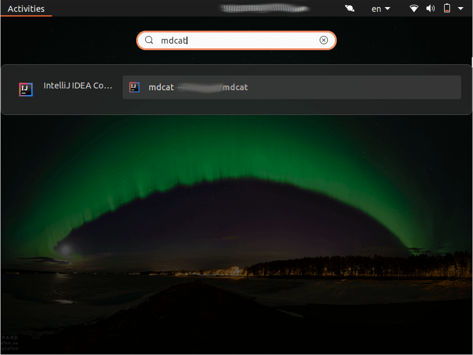

# Gnome search provider for Jetbrains projects

Add recent projects of various Jetbrains IDEs to Gnome search.

**Note:** This project is not affiliated with or endorsed by JetBrains.

Supports

- Android Studio (toolbox)
- CLion (toolbox)
- GoLand (toolbox)
- IDEA (toolbox)
- IDEA Community Edition (Arch package)
- IDEA Community Edition (toolbox)
- PHPStorm (toolbox)
- PyCharm (toolbox)
- Rider (toolbox)
- RubyMine (toolbox)
- RustRover (toolbox)
- WebStorm (toolbox)

Under the hood this is a small systemd user service which implements the [search provider][1] DBus API and exposes recent projects from Jetbrains IDEs.

[1]: https://developer.gnome.org/SearchProvider/documentation/tutorials/search-provider.html

## Installation

### Packages & binaries

I provide binary packages for Archlinux at [home:swsnr:owned](https://build.opensuse.org/repositories/home:swsnr:owned).

### From source

1. Install [rust](https://www.rust-lang.org/tools/install)

   **Note:** This program depends on Glib and Gio. Building requires the corresponding headers to be installed.

2. Build `make build`
3. Install `sudo make install`

   This installs to `/usr/local/`.

   **Note:** You really do need to install as `root`, system-wide.
   A per-user installation to `$HOME` does not work as of Gnome 40, because Gnome shell doesn't load search providers from `$HOME` (see <https://gitlab.gnome.org/GNOME/gnome-shell/-/issues/3060>).

## Debugging

To enable debug information for the service run `systemctl --user service-log-level gnome-search-providers-jetbrains.service info`.
Use `debug` instead of `info` for even more verbose logging.
The default level is `notice`.

Alternatively start the executable directly with `RUST_LOG=debug` or `RUST_LOG=trace`.

## License

Copyright Sebastian Wiesner <sebastian@swsnr.de>

This Source Code Form is subject to the terms of the Mozilla Public
License, v. 2.0. If a copy of the MPL was not distributed with this
file, You can obtain one at <http://mozilla.org/MPL/2.0/>.
